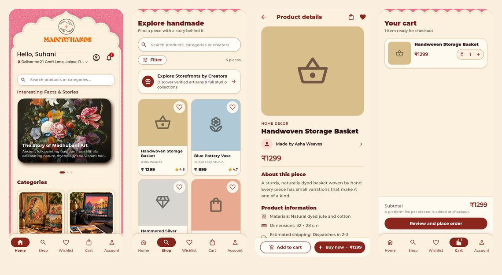
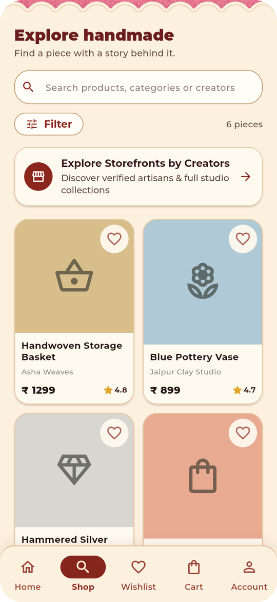
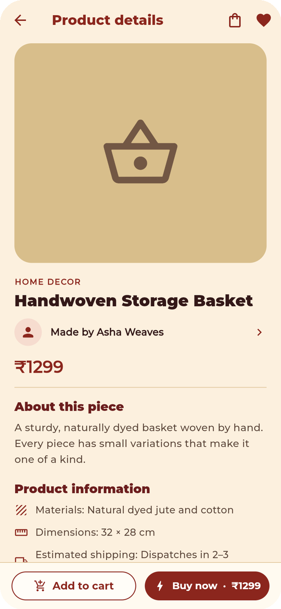
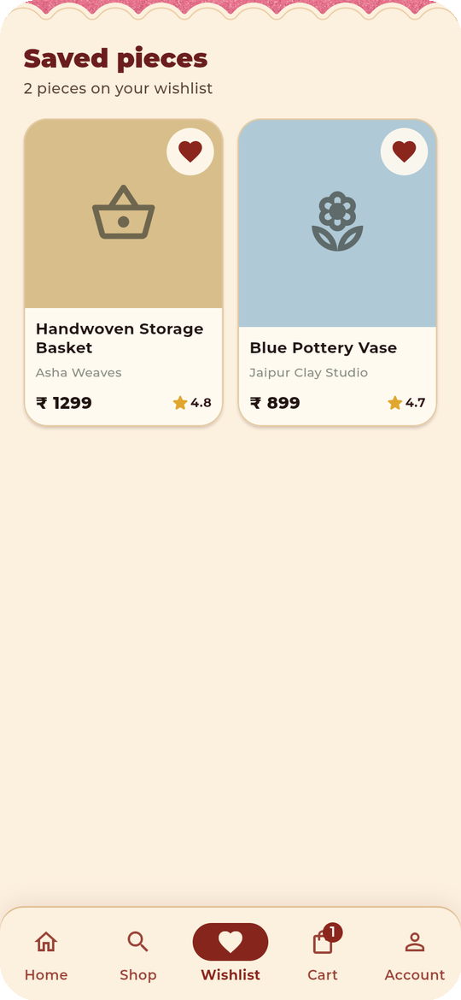
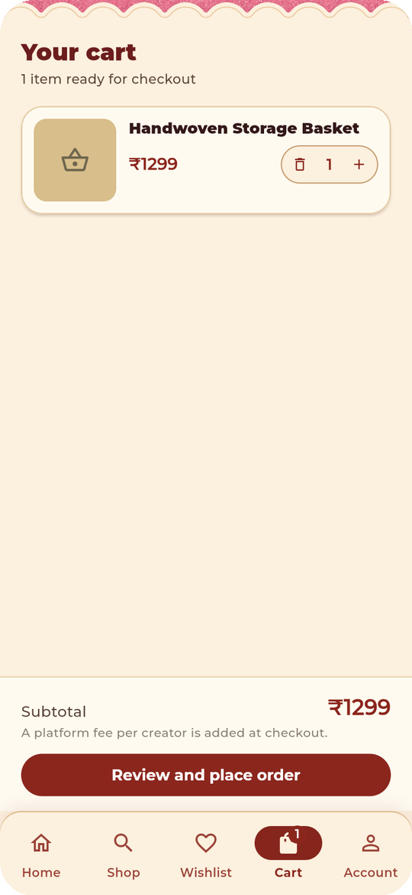
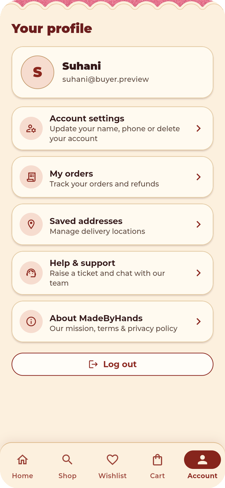

<div align="center">

# MadeByHands

**A marketplace that connects buyers with independent artisans and their handmade work.**

Flutter (Android · iOS · Web) &nbsp;·&nbsp; Firebase &nbsp;·&nbsp; Razorpay &nbsp;·&nbsp; Vercel



</div>

---

## What it does

MadeByHands has three roles in one app. Which screen a user lands on depends on
their role.

| Role | What they can do |
| --- | --- |
| **Buyer** | Browse the home feed and categories, search and filter, view creator storefronts, save favourites, build a cart, pay with Razorpay, track orders, leave reviews, raise support tickets, manage addresses and delete their account. |
| **Creator** | Onboard and get verified, list products (photos, customisation options, stock, publish or unpublish), fulfil orders with courier and consignment details, reject and refund orders, see earnings, manage payout details and read notifications. |
| **Admin** | Verify creators, approve products, manage orders (reject and refund, retry failed refunds), users, categories and support. Super admins also release payouts, set platform fees and manage admin roles. |

## Screenshots

The images below are the buyer app running with sample data
(`lib/features/buyer/buyer_preview.dart`).

<table>
  <tr>
    <td align="center"><br><sub><b>Home</b></sub></td>
    <td align="center"><br><sub><b>Categories</b></sub></td>
    <td align="center"><br><sub><b>Shop</b></sub></td>
    <td align="center"><br><sub><b>Product details</b></sub></td>
  </tr>
  <tr>
    <td align="center"><br><sub><b>Wishlist</b></sub></td>
    <td align="center"><br><sub><b>Cart</b></sub></td>
    <td align="center"><br><sub><b>Account</b></sub></td>
    <td></td>
  </tr>
</table>

## How it is built

The repository holds two deployables that share one Firestore database.

```
lib/                  Flutter client (Android, iOS, web)
  core/               theme, constants, shared services (payments, invoices)
  features/
    auth/             sign-in, role selection          (clean architecture)
    buyer/            storefront, cart, checkout        (repository per feature)
    creator/          onboarding, products, orders      (clean architecture)
    admin/            verification, finance, settings   (clean architecture)
    orders/           shared order status and fee rules
    support/          support tickets (buyers and creators)
api/ + server/        Vercel serverless functions (Node)
firestore.rules       security rules, deployed together with the API
storage.rules         Firebase Storage rules
docs/                 data schema and team notes
test/                 Flutter widget/unit tests and Node API tests
```

- **State management:** `flutter_bloc`, with `get_it` for dependency injection.
- **Data:** Cloud Firestore and Firebase Storage. Anything involving money is
  written only by the API through the Firebase Admin SDK.
- **Auth:** Firebase Authentication with Google sign-in.
- **Payments:** Razorpay. Web Checkout on the web build, the Razorpay Flutter
  SDK on Android and iOS.

### How a payment works

1. The app sends the cart lines (product ids and quantities, never prices) to
   `/api/create-order` with the user's Firebase ID token.
2. The server re-prices the cart from Firestore, adds the platform fee and
   creates the Razorpay order.
3. After checkout, the app calls `/api/finalize-payment`. The server verifies
   the signature, confirms the captured payment with Razorpay, then in one
   transaction reserves stock and writes one order per creator.
4. If anything fails after the payment is captured, the buyer is refunded
   automatically. Retrying a confirmation never creates a duplicate order.

Creators and admins reject orders through `/api/reject-order`, which restores
stock and refunds the buyer.

## Getting started

You need the Flutter SDK (Dart `^3.11.5`), Node 18 or newer, and access to the
Firebase project `madebyhands-77f87`.

```sh
flutter pub get
flutter analyze
flutter test

npm install
npm test            # payment API tests (no network or credentials needed)
```

Firebase config files are kept out of version control, so a fresh clone will not
compile until you run `flutterfire configure` against the Firebase project.

```sh
flutter run                                         # full app
flutter run -t lib/features/buyer/buyer_preview.dart  # buyer UI with sample data, no Firebase
```

Web release build (this is what Vercel runs through `vercel-build.sh`):

```sh
flutter build web --release --no-tree-shake-icons --dart-define=GOOGLE_CLIENT_ID=$GOOGLE_CLIENT_ID
```

Deploy the security rules whenever the API or the data model changes:

```sh
firebase deploy --only firestore:rules
firebase deploy --only storage
```

## Configuration

**API (set as Vercel environment variables):**

| Variable | Purpose |
| --- | --- |
| `RAZORPAY_KEY_ID` | Razorpay API Key ID |
| `RAZORPAY_KEY_SECRET` | Razorpay API Key Secret (never sent to the client) |
| `FIREBASE_SERVICE_ACCOUNT_JSON` | Service account for project `madebyhands-77f87` |
| `PAYMENT_ALLOWED_ORIGINS` | Comma-separated list of web origins allowed to call the API |

**Client build (`--dart-define`):**

| Variable | Purpose |
| --- | --- |
| `PAYMENT_API_BASE_URL` | Deployed API address. Required for Android and iOS; the web build uses its own origin. |
| `GOOGLE_CLIENT_ID` | Google OAuth web client id for web sign-in |

Use Razorpay **test** credentials until checkout and payment verification have
been tried end to end. The Razorpay API keys come from Account & Settings →
API Keys; the `razorpay.me` payment handle is not an API credential.

The web build also needs CORS applied once on the Storage bucket so product
images load:

```sh
gcloud storage buckets update gs://madebyhands-77f87.firebasestorage.app --cors-file=storage-cors.json
```

## Documentation

- [`docs/firestore-schema.md`](docs/firestore-schema.md) is the shared data contract between the panels.
- [`docs/buyer-firestore-schema.md`](docs/buyer-firestore-schema.md) is the buyer-facing contract.
- [`docs/daily-log.md`](docs/daily-log.md) records daily team changes and integration notes.
- [`CLAUDE.md`](CLAUDE.md) holds detailed architecture and convention notes for working in this codebase.

## Release checklist

Before publishing to Google Play or the App Store:

- [ ] Sign release builds with a release keystore (they are still signed with the debug key).
- [ ] Change the iOS bundle ID from `com.example.madebyhands` to `shop.madebyhands.app` and register the iOS app in Firebase.
- [ ] Add the release keystore's SHA fingerprints (and Play App Signing's, once on Google Play) to the Android app in Firebase.
- [ ] Switch Razorpay from test to live keys and set `PAYMENT_API_BASE_URL` for the mobile builds.
